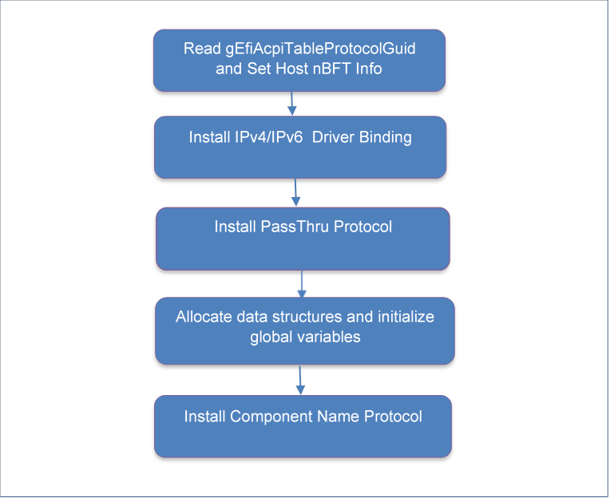
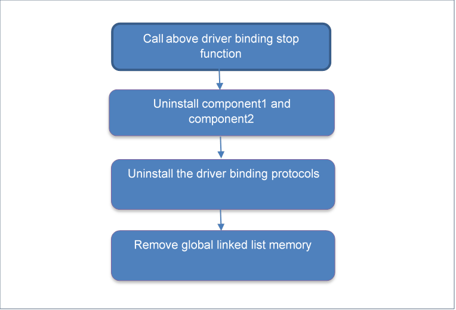
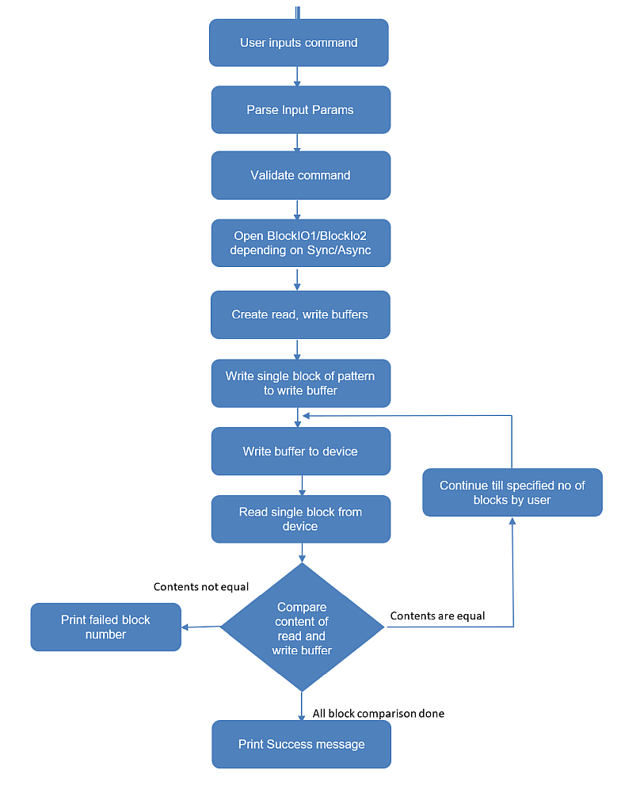

# edk2 NvmeOfDxe with TCP Driver High Level Design 

### **Document History**

|         |             |        |                             |
|---------|-------------|--------|-----------------------------|
| Version | Date        | Author | Changes                     |
| v1.0    | 2021-09-09  | Dell   | Initial Release with Github |
|         |             |        |                             |

### **Table of Contents**

- [edk2 NvmeOfDxe with TCP Driver High Level Design](#edk2-nvmeofdxe-with-tcp-driver-high-level-design)
    - [**Document History**](#document-history)
    - [**Table of Contents**](#table-of-contents)
  - [1.  <span id="_Toc81475828" class="anchor"></span>Introduction](#1--introduction)
    - [1.1  <span id="_Toc371955203" class="anchor"></span>Acronyms, and Abbreviations](#11--acronyms-and-abbreviations)
  - [1.2  <span id="_Toc81475830" class="anchor"></span>References](#12--references)
  - [2   <span id="_Toc81475833" class="anchor"></span>High Level Design](#2---high-level-design)
    - [2.1 <span id="_Toc56603914" class="anchor"></span>Architecture Block Diagram](#21-architecture-block-diagram)
  - [2.2  <span id="_Toc81475835" class="anchor"></span>Modular Transport Design](#22--modular-transport-design)
  - [3  <span id="_Toc81475836" class="anchor"></span>Design Considerations](#3--design-considerations)
    - [3.1  <span id="_Toc81475837" class="anchor"></span>PEI or DXE NVMeOF Driver](#31--pei-or-dxe-nvmeof-driver)
    - [3.2  <span id="_Toc81475838" class="anchor"></span>Block layer implementation](#32--block-layer-implementation)
    - [3.3 <span id="_Toc81475839" class="anchor"></span>DPDK library](#33-dpdk-library)
    - [3.4 <span id="_Toc81475840" class="anchor"></span>Driver Model](#34-driver-model)
  - [4 <span id="_Toc81475841" class="anchor"></span>Detailed Approach](#4-detailed-approach)
    - [4.1 <span id="_Toc81475842" class="anchor"></span>Driver Entry](#41-driver-entry)
    - [4.2 <span id="_Toc59132805" class="anchor"></span>Driver Binding Supported](#42-driver-binding-supported)
    - [4.3 <span id="_Toc81475844" class="anchor"></span>Driver Binding Start](#43-driver-binding-start)
    - [4.4 <span id="_Toc81475845" class="anchor"></span>Driver Binding Stop](#44-driver-binding-stop)
    - [4.5 <span id="_Toc81475846" class="anchor"></span>Unload](#45-unload)
      - [**Use cases considered:**](#use-cases-considered)
    - [4.7 <span id="_Toc81475848" class="anchor"></span>nBFT](#47-nbft)
      - [**Attempts Configured for Driver**](#attempts-configured-for-driver)
      - [**No Attempts Configured**](#no-attempts-configured)
    - [4.8 <span id="_Toc55952687" class="anchor"></span>UEFI Variables and OEM hook API](#48-uefi-variables-and-oem-hook-api)
      - [4.8.1 <span id="_Toc81475850" class="anchor"></span>Configuration from DHCP server](#481-configuration-from-dhcp-server)
    - [4.9 <span id="_Toc81475851" class="anchor"></span>Block Layer Implementation](#49-block-layer-implementation)
      - [4.9.1 <span id="_Toc81475852" class="anchor"></span>Block IO - Synchronous Mode](#491-block-io---synchronous-mode)
        - [4.9.1.1 <span id="_Toc81475853" class="anchor"></span>Command Submission](#4911-command-submission)
        - [4.9.1.2 <span id="_Toc81475854" class="anchor"></span>IO Completion Flow](#4912-io-completion-flow)
        - [4.9.1.3 <span id="_Toc81475855" class="anchor"></span>Block IO 2 - Asynchronous Mode](#4913-block-io-2---asynchronous-mode)
        - [4.9.2.1 <span id="_Toc81475856" class="anchor"></span>Command Submission](#4921-command-submission)
        - [4.9.2.2 <span id="_Toc81475857" class="anchor"></span>IO Completion flow](#4922-io-completion-flow)
    - [4.10 <span id="_Toc81475858" class="anchor"></span>DiskInfo](#410-diskinfo)
    - [4.11 <span id="_Toc56603928" class="anchor"></span>Device Path](#411-device-path)
    - [4.12  <span id="_Toc56603931" class="anchor"></span>Multipath](#412--multipath)
    - [4.13 <span id="_Toc59132823" class="anchor"></span>Static and Dynamic Controller](#413-static-and-dynamic-controller)
    - [4.14 <span id="_Toc56603926" class="anchor"></span>SPDK Library Porting](#414-spdk-library-porting)
    - [4.14.1 <span id="_Toc81475863" class="anchor"></span>SPDK ENV Porting](#4141-spdk-env-porting)
      - [4.14.2 <span id="_Toc81475864" class="anchor"></span>Kato Timer](#4142-kato-timer)
      - [4.14.3 <span id="_Toc81475865" class="anchor"></span>LibC Dependencies](#4143-libc-dependencies)
      - [4.14.4 <span id="_Toc81475866" class="anchor"></span>Socket API](#4144-socket-api)
  - [5 <span id="_Toc81475867" class="anchor"></span>NVMe-oF connection security](#5-nvme-of-connection-security)
  - [6 <span id="_Toc81475868" class="anchor"></span>NVMe-oF UEFI CLI Design](#6-nvme-of-uefi-cli-design)
    - [6.1 <span id="_Toc81475869" class="anchor"></span>Overview](#61-overview)
    - [6.2 <span id="_Toc81475870" class="anchor"></span>Device Identifier Key](#62-device-identifier-key)
    - [6.3 <span id="_Toc81475871" class="anchor"></span>Command Flow for Passthrough](#63-command-flow-for-passthrough)
    - [6.4 <span id="_Toc81475872" class="anchor"></span>Command Flow for ReadWrite Sync/Async command](#64-command-flow-for-readwrite-syncasync-command)
    - [6.5 <span id="_Toc81475873" class="anchor"></span>SetAttempt](#65-setattempt)
    - [6.6 <span id="_Toc81475874" class="anchor"></span>Supported Commands](#66-supported-commands)
  - [7 <span id="_Toc81475875" class="anchor"></span>Design Components](#7-design-components)
    - [7.1 <span id="_Toc81475876" class="anchor"></span>Data structures used in Driver](#71-data-structures-used-in-driver)
      - [7.1.1 <span id="_Toc81475877" class="anchor"></span>NVMeOF Driver Data Structure](#711-nvmeof-driver-data-structure)
      - [7.1.2 <span id="_Toc81475878" class="anchor"></span>Private Data Structure:](#712-private-data-structure)
      - [7.2 <span id="_Toc81475879" class="anchor"></span>CLI structures](#72-cli-structures)
      - [7.2.1 <span id="_Toc81475880" class="anchor"></span>Protocol Structure](#721-protocol-structure)
      - [7.2.2 <span id="_Toc81475881" class="anchor"></span>Connect command structure](#722-connect-command-structure)
      - [7.2.3 <span id="_Toc81475882" class="anchor"></span>Mapping structure](#723-mapping-structure)
      - [7.2.4 <span id="_Toc81475883" class="anchor"></span>Read write data structure](#724-read-write-data-structure)
      - [7.2.5 <span id="_Toc81475884" class="anchor"></span>Identify structure](#725-identify-structure)
      - [7.2.6 <span id="_Toc81475885" class="anchor"></span>Disconnect structure](#726-disconnect-structure)
      - [7.2.7 <span id="_Toc81475886" class="anchor"></span>Read Write Block structure](#727-read-write-block-structure)
  - [8 <span id="_Toc81475887" class="anchor"></span>Packaging<span id="_Toc131393231" class="anchor"></span>](#8-packaging)
    - [8.1 NVMeOF Driver Deployment Structure](#81-nvmeof-driver-deployment-structure)
      - [8.1.1 <span id="_Toc81475889" class="anchor"></span>NvmeOfDxe - Driver Files](#811-nvmeofdxe---driver-files)
      - [8.1.2 <span id="_Toc81475890" class="anchor"></span>NvmeOfCli - CLI Files](#812-nvmeofcli---cli-files)
      - [8.1.3 <span id="_Toc81475891" class="anchor"></span>NvmeOf Library Files](#813-nvmeof-library-files)
  - [<span id="_Toc81475896" class="anchor"></span>Appendix](#appendix)
    - [<span id="_Toc81475897" class="anchor"></span>Cli Commands](#cli-commands)
      - [<span id="_Toc81475898" class="anchor"></span>List](#list)
      - [<span id="_Toc81475899" class="anchor"></span>Listattempt](#listattempt)
      - [<span id="_Toc81475900" class="anchor"></span>Write](#write)
      - [<span id="_Toc81475901" class="anchor"></span>Read](#read)
      - [<span id="_Toc81475902" class="anchor"></span>Reset](#reset)
      - [<span id="_Toc81475903" class="anchor"></span>Connect](#connect)
      - [<span id="_Toc81475904" class="anchor"></span>Disconnect](#disconnect)
      - [<span id="_Toc81475905" class="anchor"></span>Identify](#identify)
      - [<span id="_Toc81475906" class="anchor"></span>Readwritesync](#readwritesync)
      - [<span id="_Toc81475907" class="anchor"></span>Readwriteasync](#readwriteasync)
      - [<span id="_Toc81475908" class="anchor"></span>Setattempt](#setattempt)
      - [<span id="_Toc81475909" class="anchor"></span>Version](#version)
      - [<span id="_Toc81475910" class="anchor"></span>Help](#help)

## 1.  <span id="_Toc81475828" class="anchor"></span>Introduction

This document intends to provide architectural detail of the NvmeOfDxe UEFI TCP transport driver that provides end-to-end NVMeOF communication from a host initiator to a target NVMe subsystem. This driver will be utilized by a edk2 UEFI BIOS pre-OS environment for booting to an OS image from an NVMeOF subsystem namespace. This document is intended to capture and convey the significant architectural decisions which have been made on the design.

### 1.1  <span id="_Toc371955203" class="anchor"></span>Acronyms, and Abbreviations

| ACPI    | Advanced Configuration and Power Interface |
|---------|--------------------------------------------|
| CLI     | Command Line Interface                     |
| CNS     | Controller or Namespace Structure          |
| DHCP    | Dynamic Host Configuration Protocol        |
| DPDK    | Data Plane Development Kit                 |
| DXE     | Driver Execution Environment               |
| EDK     | Embedded Development Kit                   |
| EFI     | Extensible Firmware Interface              |
| GCC     | GNU Compiler Collection                    |
| GUID    | Globally Unique Identifier                 |
| IOC     | IO Controller                              |
| IOMMU   | Input Output Memory Management Unit        |
| IP      | Internet Protocol                          |
| ISCSI   | Internet Small Computer System Interface   |
| MPIO    | Multi Path Input Output                    |
| nBFT    | NVMe Boot Firmware Table                   |
| NIC     | Network Interface Card                     |
| NID     | Namespace Identification Discriptor        |
| NQN     | NVMe Qualified Name                        |
| NSID    | Namespace Identifier                       |
| NVMe    | Non-Volatile Memory Express                |
| NVMe-OF | Non-Volatile Memory Express Over Fabric    |
| OEM     | Original Equipment Manufacturer            |
| PDU     | Protocol Data Unit                         |
| PEI     | Pre-EFI Initialization environment         |
| PSK     | Pre-Shared Key                             |
| RDMA    | Remote Direct Memory Access                |
| ROM     | Read Only Memory                           |
| SPDK    | Storage Performance Development Kit        |
| TCP     | Transmission Control Protocol              |
| TLS     | Transport Layer Security                   |
| UEFI    | Unified Extensible Firmware Interface      |

## 1.2  <span id="_Toc81475830" class="anchor"></span>References

| Reference | URL |
|--------------------------|-----------------------------|
| SPDK Documentation       | <https://spdk.io/doc/index.html>  |
| EDK Driver’s Guide       | <https://edk2-docs.gitbook.io/edk-ii-uefi-driver-writer-s-guide/> |
| NVMe Base Specifications | <https://nvmexpress.org/wp-content/uploads/NVM-Express-1_4b-2020.09.21-Ratified.pdf> |
| NVMeOF Specifications    | <https://nvmexpress.org/wp-content/uploads/NVMe-over-Fabrics-1.1-2019.10.22-Ratified.pdf> |
| nBFT Specification       | Version 0.32 |

## 2   <span id="_Toc81475833" class="anchor"></span>High Level Design

### 2.1 <span id="_Toc56603914" class="anchor"></span>Architecture Block Diagram


The above diagram shows the architectural block diagram of the NVMeOF Driver and the other module it will interact with. The key components details are:

**NVMeOF CLI:** The NVMeOF CLI will be used for basic testing of NVMeOF Driver. It consists of command parsing module, data output module and module for interacting with the NVMeOF driver through UEFI driver protocols.

**NVMeOF Driver:** The NVMeOF Driver has 3 key components:

-   Base driver will perform tasks like initialization, shutdown, Block IO interfacing, DiskInfo, nBFT and passthrough commands.

-   The NVMeOF lib will contain subset of SPDK, NVMe over TCP functionality.

-   The NVMeOF Transport protocol module purpose will be to keep the base driver implementation transport agnostics and make the design modular to introduce different transports types in future.

**UEFI components:** The NVMeOF will interact with the following UEFI components:

-   **UEFI BlockIO**: The driver will register with Block IO interface so that any NVMeOF disk related block calls will be sent to the driver

-   **UEFI Device path**: The NVMeOF driver will register complete device path of each namespace with the UEFI subsystem which helps operating systems and their loaders to identify the hardware by device handles.

-   **UEFI TCP Stack and UEFI OpenSSL library**: The NVMeOF will support use of native TCP stack provided by UEFI for sending and receiving TCP PDU’s over the sockets, the communication between them can be optionally secured. The secured connectivity will be provided by utilizing the UEFI OpenSSL library with support for TLS version supported by UEFI EDK2.

## 2.2  <span id="_Toc81475835" class="anchor"></span>Modular Transport Design

In order to keep the driver design modular and transport agnostic, the transport specific implementation is packaged as different module and loosely coupled with the base driver. In future, to support different protocols we need to implement protocol specific module as per the defined interfaces to base driver. As a part of this implementation only TCP protocol will be implemented. Multiple such transport protocol implementations for different types of transports can exist at a given point of time. The protocol to be used will be an input parameter to the driver in-form of a UEFI variable containing GUID of the protocol to be used. Based on the input, required protocol will be located/opened to obtain the protocol handle. This protocol handle will be consumed by the NVMeOF library to use transport specific functionalities.

The NVMeOF library will implement a transport shim layer in-order to alter the existing call flow sequence. The transport layer in library will call shim layer functions and shim layer in-turn will invoke transport specific functions using the protocol handle instance passed by the driver.


## 3  <span id="_Toc81475836" class="anchor"></span>Design Considerations

### 3.1  <span id="_Toc81475837" class="anchor"></span>PEI or DXE NVMeOF Driver

PEI (Pre-Efi Initialization phase) configures the entire platform and then loads the DXE. DXE (Driver eXecution Environment) is where the UEFI system loads drivers for configured devices, if necessary; mount the drives and find and executes the boot code.

-   Currently in EDK there are 2 different NVMe PCIe drivers for PEI and DXE respectively. The PEI driver will be used in case there are additional drivers to be loaded from the NVMe storage (like expansion ROM). In case of NVMeOF driver there is no such requirement, as pre-initialization of the system (network configuration) will be done earlier to discovering the NVMeOF namespaces.

-   NVMeOF driver is intended to provide system boot over TCP by connecting to the NVMeOF target. The iSCSI driver which provides similar service using SCSI over TCP is also implemented as DXE module.

Based on the requirements as well as above references, the NVMeOF driver will be designed to work only in DXE.

### 3.2  <span id="_Toc81475838" class="anchor"></span>Block layer implementation

The SPDK block layer is designed considering multi-core and multi-thread environment. UEFI environment works in single core without preemption model and does not support threading. The SPDK block layer is written as generic independent library with support for NVMe as module. The new NVMeOF driver block module will use UEFI BlockIO protocol and talk directly with the NVMe library functions (lib/nvme directory of SPDK) instead of routing through the SPDK block layer (modules/bdev) to simplify the design.

### 3.3 <span id="_Toc81475839" class="anchor"></span>DPDK library

The SPDK uses DPDK library for performing key OS related operations and designed to work in Linux, FreeBSD and Windows environment only. The SPDK uses DPDK functions related to memory management, queues, threading, locking, PCIe and virtual to physical conversions etc. To use SPDK in UEFI EDK II environment the env related calls from EDK will be used e.g. memory management. In case there are no equivalent ones available then reference of other EDK II libraries will be used rather than creating a new version.

### 3.4 <span id="_Toc81475840" class="anchor"></span>Driver Model

The NVMeOF driver is required to be modelled to have a base module which will implement things like Block IO, Device path, nBFT etc. and the transport protocol specific module is required to be independent of the transport type so that in future it can cater to other protocols. There are 2 ways these 2 modules can co-exist.

**Base and Transport in Single Driver:** In this configuration both the modules will exist as single driver and will share same copy of SPDK library as it is statically linked. The Base driver will install and locate transport specific protocol in its Startup function based on GUID. And for any transport specific operation it will simply call these transport API making the driver transport independent.

**Base and Transport as Different Drivers**: In this configuration there will be 2 sets of drivers and both will have its own copy of SPDK library. Here the transport driver will install transport specific protocol which will be located and used by the base driver. The disadvantage of this method is that each copy may have its own instance of the SPDK library.

To make development easier and to prevent any possible multiple instance issue the single driver configuration will be used in the NVMeOF driver development.

## 4 <span id="_Toc81475841" class="anchor"></span>Detailed Approach

### 4.1 <span id="_Toc81475842" class="anchor"></span>Driver Entry

This is the method which is invoked when the UEFI driver is loaded. The entry point for a specific driver can be defined using ENTRY\_POINT entry in .inf file. The entry point for NVMeOF driver will allocate resources, initialize global variables, install the IPv4 and IPv6 related driver bindings and the component name protocol.



### 4.2 <span id="_Toc59132805" class="anchor"></span>Driver Binding Supported

The Supported method is primarily used for checking if the driver supports the device specified by ControllerHandler. In case of NVMeOF since the connection is not done at this point and considering reference of iSCSI ‘Supported’, the following steps will be performed to verify if networking layer is up or not which are essentials for running NVMeOF TCP driver.


### 4.3 <span id="_Toc81475844" class="anchor"></span>Driver Binding Start

Driver Binding Start() method is invoked for the controller handle for which the success is returned from the Supported() method. The driver will read the HII configuration provided in form of UEFI variable which contains array of structures, each representing an attempt configured for connection to the target. Each attempt will be used to connect to specified target The driver binding start method will also be responsible for installing/locating various protocols implemented and used by the driver and allocate resources to be used by the driver. Based on inputs, this method will perform discovery of namespaces and register the selected namespaces with the block layer and create device paths for them. Publishing the namespaces to nBFT will also be performed here.

The following is the flow of the Start function of the NVMeOF driver


### 4.4 <span id="_Toc81475845" class="anchor"></span>Driver Binding Stop

This method is used for stopping a device controller or a bus controller. It will perform following tasks as part of driver binding stopping


### 4.5 <span id="_Toc81475846" class="anchor"></span>Unload

In unload iterate all the controllers and call disconnect controller



18. <span id="_Toc81475847" class="anchor"></span>Discovery

The Discovery of controllers will be performed in the Start or through CLI. Discovery of NVM controllers over fabrics will be of following types:

-   **Direct Connect** – Via IP/Port, SubNQN, NSID or NID – Will open a connection to the subsystem directly.

-   **Discovery** – Via IP/Port to a Discovery Controller (Fixed Discovery NQN) and will return IOC IP/Port/NQN(s). Then must Connect and acquire NSID list (CNS 02h) from IOC.

The address/NQN of the controller to be discovered will be a user input obtained using OEM hook/UEFI variables implemented for this purpose. SPDK supports direct connect as well as discovery of subsystems of the discovery controllers. If the NQN to be discovered is identified as a discovery controller NQN, the discovery log page will be obtained from the controller and each subsystem will be probed. Only NVM type of subsystem from the obtained discovery log page records will be supported i.e. if a log page entry from a discovery controller contains another discovery controller as its subtype, SPDK does not discovers namespaces behind it.


#### **Use cases considered:**

- **Direct connect without Namespace ID(NID)**

    - **User Inputs** – IP address and NQN of the subsystem to be connected.
    - **Actions** – Connect to the subsystem using the IP address and NQN. Discover the namespaces, enumerate all the namespaces with block layer and create device path for each of them.
-   **Direct connect with Namespace ID(NID)**

    - **User Inputs** – IP address, NQN and NID.
    - **Actions** – Connect to the subsystem using the IP address and NQN. Discover the namespaces. Register with block IO and create device path for only the namespace whose NID matches with the input NID. Throw an error if no NID for the discovered namespaces matches with the input NID.
-   **Discovery controller without Namespace ID(NID)**
    - **User Inputs** – IP address and NQN of the discovery controller.
    - **Actions** – Discover the subsystems and the namespaces behind each subsystem of the discovery controller. Register block interface and device path for all the discovered namespaces.
-   **Discovery controller with Namespace ID(NID)**
    - **User Inputs** – IP address, NQN of the discovery controller and NID.
    - **Actions** – Discover the subsystems and the namespaces behind each subsystem of the discovery controller. Match the namespace ID of the discovered namespaces with the input NID. Register with block layer and create device path for only the matched namespace. Throw an error if no NID for the discovered namespaces matches with the input NID.

### 4.7 <span id="_Toc81475848" class="anchor"></span>nBFT

The NVMe Boot Firmware (nBF) Table (nBFT) is a block of information containing various parameters useful to the boot process using NVMeOF. The nBFT is the mechanism by which nBF parameter values are conveyed to the operating system. The nBF builds and fills in the nBFT. The nBFT is available to the operating system to enable a consistent flow of the boot process.


| **Structures** | **Description**   |
|----------------|-------------------|
| Host           | The Host structure specifically defines details that are scoped globally to the initiator. Only one instance of this structure should exist per physical or logical system that must comprehend boot from NVMeOF |
| Adapter        | Adapter structure |
| Namespace      | The Subsystem Namespace Sub-Structure defines the Subsystem and Namespace specific parameters needed to atomically identify the namespace attached to and as available during system initialization and the boot process. |
| Security       | The security sub-structure defines the various connectivity features. |
| Discovery      | The discovery sub-structure contains an index of all discovery controllers that have been collected by a UEFI BIOS before OS execution. The intent of this table is to allow an OS client who cannot dynamically discover subsystems but can perform basic connections to discovery controllers as outlined in NVMeOF to still acquire additional namespaces. |

Configuration data obtained from HII using the OEM hook API’s or UEFI variables will be used as input data to discover the controller and namespaces managed by the controllers. The discovered namespaces will be filtered using another OEM hook. The discovered namespaces and the associated host, adapter and security related information will be populated in the sections of nBFT structure fields. The ACPI protocol GUID will be used to open ACPI table, locate the start of the nBFT table, update the structure information and install it back to ACPI protocol. The host information like Host ID and Host NQN will be populated to nBFT table from the driver entry irrespective of the attempts configured. The flow diagram below illustrates the steps involved in publishing the nBFT table to ACPI.

#### **Attempts Configured for Driver**

Use case of having attempts to configure the driver with.


#### **No Attempts Configured**

Use case that attempts have not been configure but driver is available.


### 4.8 <span id="_Toc55952687" class="anchor"></span>UEFI Variables and OEM hook API

**TODO**: It is expected that Security parameters related to Authentication and Transport Security will have an impact on this section, including Host and Subsystem variables.  This section will need to explicitly be updated when those design details are resolved.

The UEFI variables will be used for transferring parameters amongst NVMeOF driver and other UEFI modules. The below mentioned UEFI variable will be created by HII and will be used as input parameters to the driver. The driver will consume these variables and use the information for discovering the subsystems and namespaces.

Variable types:

-   Target Information:

> DHCP (enable/disable), IP Type, IP address, Port, Subsystem NQN and NID.

-   Host information:

> Host NQN, Host ID, Network Interface, DHCP (enable/disable), IP, Subnet, gateway and VLAN tag.

-   Global configuration flags/PCD’s as needed by driver (e.g.: transport type selection - TCP)

-   Attempt enable/disable, Target count, Driver version

The NVMeOF Driver will implement helper functions for getting and setting these UEFI variable. These functions will have variable name and access level attributes as input parameters.

Any dynamic data obtained during the discovery of the subsystems/namespaces (e.g. subsystems behind the discovery controller) will be exposed by the driver as UEFI variable (NvmeOfDiscoveryData) This will be useful for other UEFI modules which intend to get this information from the driver. Also, such information will be part of nBFT structures which can be accessed using the OEM hook API. The visibility of these UEFI variables will be EFI\_VARIABLE\_BOOTSERVICE\_ACCESS only as they are not required by the operating system (Runtime service).

Driver will produce protocol which will be consumed as OEM hooks for the following:

-   Getting configuration data from the HII or any OEM specific source. The configuration data can be in form of direct addresses to connect to the controller or address of a discovery controller to discover the namespaces for it. This data will be used to discover the namespaces and fill the nBFT structure sections.

-   Getting the list of filtered namespaces which will be enumerated by the block interface. This is required for OEM specific filtering of the namespaces for block interface and ACPI/nBFT publishing.

-   Exporting the nBFT specific parameters to the OEM’s, to publish nBFT to ACPI in OEM specific manner.

In current implementation one function is called as part of filtering and this function is currently returning all the namespaces, in future this API can be modified for performing filtering as per requirement.

#### 4.8.1 <span id="_Toc81475850" class="anchor"></span>Configuration from DHCP server

The configuration parameters passed to the driver will contain separate variables (namely HostInfoFromDHCP and TargetInfoFromDHCP) to indicate whether the host and target configuration parameters are to be read from UEFI variables or queried from the DHCP server.

In-case HostInfoFromDHCP is enabled, the DHCP server request will be used to get the IP address, subnet mask and router (gateway address) of the host. The DHCP server uses pre-defined “option” indexes to send this information to the client. These indexes can be used to parse the specific information from the DHCP acknowledgement obtained from the server.

In-case TargetInfoFromDHCP is enabled, the DHCP option 17 (rootpath) in response will be used to get the target information and use it for connection. The target information from the DHCP server will contain the following:

**Direct Connect:**

NVME\[+PROTOCOL\]://&lt;SERVERNAME/IP&gt;\[:TRANSPORT PORT\]/&lt;SUBSYS NQN&gt;/&lt;NID&gt;

**Discovery Controller:**

NVME\[+PROTOCOL\]://&lt;DISCOVERY CONTROLLER ADDRESS&gt;\[:DISCOVERY CONTROLLER PORT\]/nqn.2014-08.org.nvmexpress.discovery/&lt;NID&gt;

-   Where NVME indicates the storage type

-   PROTOCOL field is the fabric type , if blank TCP is assumed

-   SERVERNAME is the name or IP of the NVMe target

-   SUBSYS NQN of the target subsystem

-   Namespace Identification Descriptor (NID)

-   TRANSPORT PORT: if not specified default to 4420

-   DISCOVERY CONTROLLER PORT: If the Discovery Controller Port is blank, but Discovery Subsystem NQN Address is populated, assume 8009, else assume default Subsystem Transport Port Address as 4420.

The specific UEFI variables will be empty when DHCP is enabled for host/target information.

### 4.9 <span id="_Toc81475851" class="anchor"></span>Block Layer Implementation

Each namespace will be registered with the Block IO layer. The NVMeOF driver will handle the callback functions for any Read/Write request from this layer. The driver will register with both the block interfaces namely the Block IO and Block IO 2 which provides synchronous mode and asynchronous mode of operation respectively. The subsequent section describes each mode in detail.

#### 4.9.1 <span id="_Toc81475852" class="anchor"></span>Block IO - Synchronous Mode

In synchronous mode of operation each request which will be coming from the block layer will be sequentially submitted to the NVMe controller and the completion will be polled synchronously.

The flow is divided into 2 parts, the command submission and command completion part. The NVMeOF Block IO handler will incorporate the callback function which are registered at time of driver Initialization. The block layer will invoke the registered callback in order to process the UEFI IO operations on that disk. For e.g. NvmeBlockIoReadBlocks will be invoked for performing Read operation.

##### 4.9.1.1 <span id="_Toc81475853" class="anchor"></span>Command Submission

The spdk\_nvme\_ns\_cmd\_read function is a public interface provided by SPDK for sending read operation. It will call the function \_nvme\_ns\_cmd\_rw. This function will split the request into multiple requests as required and will submit each of them separately. The nvme\_transport\_qpair\_submit\_request will call the transport shim layer function and ultimately the TCP specific SPDK function (nvme\_tcp\_qpair\_submit\_request) will be called using the transport protocol handle. The TCP function will create a network packet capsule and send it using nvme\_tcp\_qpair\_capsule\_cmd\_send. The request will reach the target using the SSL/NonSSL UEFI TCP socket.

The call flow from NVMe driver to SPDK in order to accomplish Read request is as follows:


##### 4.9.1.2 <span id="_Toc81475854" class="anchor"></span>IO Completion Flow

The spdk\_nvme\_qpair\_process\_completion is the public interface function provided by SPDK which will be used to get the completions from it. The process of completion involves reading of response PDU from the socket, processing it and invoking the upper layer callback function to indicate the completion.


##### 4.9.1.3 <span id="_Toc81475855" class="anchor"></span>Block IO 2 - Asynchronous Mode

In asynchronous mode of operation, the requests from the block layer will be initially inserted in a queue of pending requests and the flow will return to the caller of the request. A timer event will be created to periodically invoke a callback function and process the requests in the pending queue. The request from the queue will be submitted to the SPDK layer for further processing. This processing is exactly same as the synchronous mode of operation. A token sent from the block layer contains an event which will be used to signal completions for the block layer.


##### 4.9.2.1 <span id="_Toc81475856" class="anchor"></span>Command Submission

NvmeOfBlockIoReadBlocksEx is the callback function registered with Block I/O2 to submit the read request to the driver. The request will be divided into smaller tasks if required and then queued to the pending queue. A timer-based callback submits the request to the SPDK layer and finally to the target.


##### 4.9.2.2 <span id="_Toc81475857" class="anchor"></span>IO Completion flow

The requests completion polling will also be periodic based on a timer event which will invoke SPDK public API to get the completions and process them.


### 4.10 <span id="_Toc81475858" class="anchor"></span>DiskInfo

DiskInfo protocol is used by UEFI to get any disk related information. In case of NVMeOF each namespace whose block interface is created will also register with the DiskInfo protocol. For any DiskInfo request from the lower layer, the driver will return the identify command data for specified namespace.

In NVMeOF driver start function InitializeDiskInfo function will Initialize the DiskInfo structure and register a call back API for the same. The following structure contains the callbacks to be registered as part of DiskInfo.

|EFI_DISK_INFO_PROTOCOL structure | Function pointer|Description|
|---------------------------------|-----------------|-----------|
|EFI_GUID | Interface |A GUID that defines the format of buffers for the other member functions of this protocol.|
|EFI_DISK_INFO_INQUIRY | Inquiry |Return the results of the Inquiry command to a drive in InquiryData data. This field will be initialized to NULL as this is non-SCSI driver.|
|EFI_DISK_INFO_IDENTIFY | Identify |Return the results of the Identify command to a drive in IdentifyData data. Data format of Identify data is defined by the Interface GUID.|
|EFI_DISK_INFO_SENSE_DATA | SenseData |Return the results of the Request Sense command to a drive in SenseData data. This will be initialized to NULL as this is non-SCSI driver|
|EFI_DISK_INFO_WHICH_IDE | WhichIde |Specific controller. This will be initialized to NULL as this is non-SCSI/IDE driver|

### 4.11 <span id="_Toc56603928" class="anchor"></span>Device Path

The Device Path Protocol provides a unique name for each physical device in a system. The Device Path protocol helps the operating system to identify the hardware that a device handle represents. In case of NVMeOF driver It will be created per namespace during initialization of the device in Startup function or when user explicitly connects a controller/namespace using CLI.

Example of device path for IPv4 system:

```
PciRoot(0)/Pci(19\|0)/Mac(001320F5FA77,0x01)/IPv4(192.168.0.100,TCP,Static,192.168.0.1)/NVMEoF(nqn.1991-05.org.nvme:nvmeoftarget-nvmeofdisk-target,4eff7f8e-d353-4e9b-a4ec-deea8eab84d7)/HD(1,GPT,15E39A00-1DD2-1000-8D7F-00A0C92408FC,0x22,0x2710000)
```

-   **PciRoot(0)/Pci(19\|0)** – PCI location of the NIC card in use, which consists of PCIe Root complex followed by PCI Controller bus and function.

-   **Mac(001320F5FA77,0x01)** – MAC address of the local NIC and port number.

-   **IPv4(192.168.0.100,TCP,Static,192.168.0.1**) – Local IP, Static/DHCP IP assignment and the target IP address.

-   **NVMEoF(nqn.1991-05.org.nvme:nvmeoftarget-nvmeofdisk-target,4eff7f8e-d353-4e9b-a4ec-deea8eab84d7**) – Subsystem NQN and NID in UUID format. This data can be obtained from the identify command data. Also, the input parameters to the NVMeOF driver will contain a NID string which can be used to compare with discovered NID and .use it ahead if matched.

-   **HD(1,GPT,15E39A00-1DD2-1000-8D7F-00A0C92408FC,0x22,0x2710000** – This part describes disk related parameters and will be populated by block/FS layer

- The following section describes the flow of how device path will be created:


### 4.12  <span id="_Toc56603931" class="anchor"></span>Multipath

The NVMeOF driver will consider following points in multipath implementation:

-   The NVMeOF driver will process all attempts and create Block devices however if all the parameter like IP,Port,NQN and MACID are matching then it shall be skipped

-   The data of all the attempts will be published to nBFT irrespective of connection being successful or it has been tried

-   As this is preboot environment automatic connection/failover to redundant paths will not be performed

### 4.13 <span id="_Toc59132823" class="anchor"></span>Static and Dynamic Controller

In the static model, several controllers may be exposed. A connection to a specific one may be requested by specifying its controller ID (which is unique only within the NVM subsystem). If a value of 0xFFFE (65534 in decimal) is provided, any one of the controllers may be allocated for the connection. In the static model a value of 0xFFFF (65535 in decimal) or above is invalid. In the dynamic model, the NVM Subsystem will dynamically allocate a controller. Any value other than 0xFFFF (65535 in decimal) specified will be consider invalid. If the controller ID is unset, it defaults to 0xFFFF (the value used in the dynamic model). Whether the NVM subsystem supports the dynamic or static model can be determined by examining the corresponding discovery log page entry returned for it. SPDK does not support static controller.

In process of connecting to the controller, a fabric connect command is send to the controller. In case of connect to the admin queue pairs, the SPDK host implementation sets the controller ID field in connect data to 0xFFFF. This suggests that SPDK host implementation uses dynamic model to get a controller allocated from the NVMe subsystem. Later as part of controller initialization, the identify data gives the actual controller ID of the allocated controller which is then used for connecting to IO qpairs of the specific controllers in the subsystem.

### 4.14 <span id="_Toc56603926" class="anchor"></span>SPDK Library Porting

SPDK library is designed to run on multiple platform namely Linux, FreeBSD and Windows (newer version) and uses POSIX and C library. The SPDK uses DPDK library for performing PCIe, Memory management, Ring buffer and virtual to physical conversion. The SPDK was designed in mind that not all users will be interested in using DPDK, as DPDK is designed more for Unix related operations. The SPDK developers added env.c which serves as bridge between the SPDK and DPDK, so to port the SPDK to EDK UEFI platform the corresponding equivalent calls needs to be identified for the functions which are required for NVMeOF TCP operation. The PCIe related calls can be omitted.

### 4.14.1 <span id="_Toc81475863" class="anchor"></span>SPDK ENV Porting

|Number|Call type|SPDK ENV calls      |Equivalent EDK call/technique  |
|------|---------|--------------------|-------------------------------|
|1|Memory management calls|spdk_malloc|AllocatePool                   |
|||spdk_zmalloc                       |AllocateCopyPool OR SetMem     |
|||spdk_realloc                       |FreePool and then AllocatePool
|||spdk_free                          |FreePool
|||                                   |The AllocatePool() and FreePool() boot services are used by UEFI drivers to allocate and free small buffers that are guaranteed to be aligned on an 8-byte boundary. These services are ideal for allocating and freeing data structures.<br><br>The AllocatePages() and FreePages() boot services are used by UEFI drivers to allocate and free larger buffers that are guaranteed to be aligned on a 4 KB boundary. These services allow buffers to be allocated at any available address, at specific addresses, or below a specific address.
|2|DMA able Memory allocation calls|spdk_dma_malloc|AllocatePoolAllocateCopyPool OR SetMemFreePool and then AllocatePool
|||spdk_dma_zmalloc|AllocatePoolAllocateCopyPool OR SetMemFreePool and then AllocatePool
|||spdk_dma_realloc
|||spdk_dma_free   | FreePool
|3|SPDK env related calls|spdk_env_opts_init|Place holder functions will be implemented with no operations.
|||spdk_env_fini|
|4|SPDK memzone related calls|spdk_dma_free|memzone is only used for PCIe DMA devices. They will be dummy functions and return values wherever required.|
|||spdk_memzone_reserve||
|||spdk_memzone_lookup||
|||spdk_memzone_free||
|||spdk_memzone_dump||
|||spdk_mempool_get_name||
|||spdk_mempool_free||
|||spdk_mempool_get||
|||spdk_mempool_get_bulk||
|||spdk_mempool_put||
|||spdk_mempool_put_bulk||
|||spdk_mempool_count||
|||spdk_mempool_lookup||
|5|SPDK CPU related calls|spdk_env_get_core_count
|||spdk_env_get_current_core|No operation required to be done, because EDK2 not give control on CPU to run task. <br>These will be only placeholder functions always returning “1” value (i.e indicating single core).
|||spdk_env_get_first_core||
|||spdk_env_get_last_core||
|||spdk_env_get_next_core||
|||spdk_env_get_first_core||
|6|Socket related|Spdk_env_get_socket_id|Not used in any nvme lib code. They will be dummy functions and return values wherever required.|
|7|Thread related|spdk_env_thread_launch_pi|Not used in any nvme lib code. They will be dummy functions and return values wherever required.|
|||spdk_env_thread_wait_all
|||spdk_process_is_primary
|8|Ticks and Delays|spdk_get_ticks|In current implementation zero will be returned as the value of current tick, but following can be done where there is timer present in hardware.<br>GetPerformanceCounter :<br> * Return current nanoseconds <br>GetPerformanceCounterProperties : <br> *   Retrieves the 64-bit frequency in Hz.<br>MicroSecondDelay, NanoSecondDelay:<br>* Stalls the CPU for the number of microseconds specified by MicroSeconds.<br>CpuPause Or Stall<br>* Requests CPU to pause for a short period of time.|
|||spdk_get_ticks_hz||
|||spdk_delay_us||
|||spdk_pause||
|9|Ring/Queue related|spdk_ring_create|Need to use LIST_HEAD. Code from LinkedList.c can be used as reference. Need to implement the function, allocate structure and create circular queue. This function will free all circular queue items. Return total number of items in circular queue. This function will remove the item from circular queue. This function will add new item in circular queue.|
|||spdk_ring_free
|||spdk_ring_count
|||spdk_ring_dequeue
|||spdk_ring_enqueue
|10|PCIe, IOMMU, Virt to Phy|PCIe, IOMMU, Virt to Phy|They will be dummy functions and return NULL values wherever required.|
|11|CPU Affinity|spdk_unaffinitize_thread||Since Threads are not supported, no operations will be performed.|
|||spdk_call_unaffinitized||
|12|Memory Map related|spdk_mem_map_free|They will be dummy functions and return NULL values wherever required.|
|||spdk_mem_map_clear_translation
|||spdk_mem_**map_translate
|||spdk_mem_register
|||spdk_mem_unregister
|||spdk_mem_reserve
|||spdk_mem_get_fd_and_offset
|13|Posix threads and Mutex locks|Posix threads and Mutex locks|Since Threads are not supported, no operations will be performed. Ideally no need for lock but EFI supports EfiAcquireLock and EfiReleaseLock calls.|

#### 4.14.2 <span id="_Toc81475864" class="anchor"></span>Kato Timer

A periodic timer will be implemented to send keep-alive commands to the connected controllers to keep the connection active. The default keep-alive timeout for the NVMeOF driver is set to 6000 microseconds. For CLI, the default keep-alive timeout value is set to ‘0’ which indicates infinite timeout which never expires until disconnected.

#### 4.14.3 <span id="_Toc81475865" class="anchor"></span>LibC Dependencies

The SPDK code was written considering libc and POSIX environment in mind, the EDK does not support POSIX and EDK2 libc is maintained as a different repository, keeping in mind that this code will merge later in the EDK repository, the goal is to remove dependency on EDK2 libc.

To perform porting the following points will be considered:

-   The first preference will be evaluating and removing a libc dependency (or creating a clean stub to an EDK2 function).

-   If it’s not possible to remove dependency, use a subset of those helper functions like OpenSSL.

-   The goal is to use reference of existing libc functions in tianocore/EDK2 that other libraries have if needed rather than creating own extract from a new bsd libc. Instances where the libc helper are used will be documented.

The list of files using libc dependencies is as below:

-   nvme\_ctrlr.c

-   math.c

-   sock.c

-   env.c

-   string.c

-   bit\_array.c

-   log.c

-   nvmf\_spec.h

-   likely.h

-   string.h

-   nvme\_ocssd.h

-   uuid.h

Also, the compiler attributes which are not supported by EDK 2 will be taken care into while porting.

The dependency on LibC functionality like string, memory operations functions will be removed by writing a new function or making wrapper on existing string functions. The following is the list of functions:

| **Name of File** | **Functions**  |
|------------------|----------------|
| std\_string.c    | strchr, toupper, tolower, strcmp, strspn, strcspn, isspace, isdigit, isupper, isalpha, isalnum, Digit2Val, strtol, stroll, rand, srand, sprintf\_s and usleep. |
| std\_string.h    | memcpy, memset, memchr, memcmp, memmove.    |
| stdlib\_types.h  | int8\_t, int16\_t, int32\_t, int64\_t, uint8\_t, uint16\_t, uint32\_t, uint64\_t   |

std\_error.h file will be created for assigning SPDK error values equivalent to edk2 error values.

#### 4.14.4 <span id="_Toc81475866" class="anchor"></span>Socket API

The SPDK implementation uses POSIX socket library calls for socket operations since edk2 does not support natively but supports TcpIoLib sockets. The following functions will be implemented as edk\_sock.c which will implement the required socket calls. The group socket API’s will not be supported as they are not required.

| **Name of Function**     | **Description** |
|--------------------------|-----------------|
| edk\_sock\_connect       | Get attempt for current Nic and search for target IP,port,macid in attempt data to retrieve required parameters and Create native Tcp Io socket . This data will be saved in spdk datastructure |
| edk\_sock\_close | Remove the entry from the queue and destroys the socket  |
| \_sock\_flush | This function will use TcpIoTransmit function and responsible for transmitting data  |
| edk\_sock\_writev\_async | If there is enough data queued it will call \_sock\_flush() function to transmit the data  |
| edk\_sock\_readv  | It is used for receiving data, and uses TcpIoReceive function  |

## 5 <span id="_Toc81475867" class="anchor"></span>NVMe-oF connection security

**TODO**: This section retained as a stub for future NVMe-oF connection Security considerations.  From the overall proposal, it is sumised that such a secure connection would continue to occur using TCP protocol sockets leveraging EDK2 CryptoPkg, and a handful of inputs from other driver layers would need to be considered, such as MACs, IPs, and SPDK interfaces as well as policy information like allowed hashes.  This is future design content.

## 6 <span id="_Toc81475868" class="anchor"></span>NVMe-oF UEFI CLI Design

### 6.1 <span id="_Toc81475869" class="anchor"></span>Overview

NvmeOfCli will be used for performing basic tasks like facilitating basic diagnostics incase main path (attempts) fails and performing the block IO path testing. The NvmeOfCli will interact with the driver through passthrough protocol for performing its task and this driver will further interact with the target. NvmeOfCli commands are validated by the command parser. It will identify the command and switch to the command specific function and locate the driver specific protocol function. Also pass the parameters to the driver, and the driver pass these parameters to the SPDK function. The cli will support well-formed commands in which user will be giving a definite command and command specific parameter. The CLI will send them to the driver and display a well-formed (i.e., interpret the data from the command) output.

The CLI will also support list command information of each namespaces which are currently connected using Block IO attempt path.

### 6.2 <span id="_Toc81475870" class="anchor"></span>Device Identifier Key

A data structure will be maintained for holding information related to the connections and each namespace will hold a unique identifier. The identifier will be used for other supported commands like Read, Write etc. The identifier will be similar to NVMe representation in Linux. This Device Identifier Key is given as an argument for the passthrough specific commands and not for block IO path. List command shows the Device Identifier Key for each connected device. E.g. Device Identifier key: nvme1n1, “nvme” will be constant whereas first number after nvme is the CLI controller id and after ‘n’ will be the CLI namespace id. The key will be like nvme(Controller Id)n(Namespace id).

List command output:

FS0:\\&gt; NvmeOfCli.efi list  
Node : nvme1n1  
NID : b25579bd-77c1-4507-b7e9-4166612e50b9  
SN : 855b090558d284bd  
Model : Linux  
NSID : 2  
Usage : 6GiB  
Format : 512  
FW Rev : 5.8.0-48


### 6.3 <span id="_Toc81475871" class="anchor"></span>Command Flow for Passthrough



### 6.4 <span id="_Toc81475872" class="anchor"></span>Command Flow for ReadWrite Sync/Async command

### 6.5 <span id="_Toc81475873" class="anchor"></span>SetAttempt

The NVMeOF CLI will support setattempt command which will be used for mimicking HII ‘s behavior of setting Host and Attempt UEFI variables. This command will read a user configuration file which contains user attempts and after performing basic validation it will write the 2 UEFI variables.

### 6.6 <span id="_Toc81475874" class="anchor"></span>Supported Commands

| Sr. No. | Command        | Description                                                          |
|---------|----------------|----------------------------------------------------------------------|
| 1       | list           | Lists all namespace connected using Passthrough protocol             |
| 2       | read           | Perform Read operation on devices created with Passthrough protocol  |
| 3       | write          | Perform Write operation on devices created with Passthrough protocol |
| 4       | reset          | Resets the controller                                                |
| 5       | connect        | Connect to NVMeOF subsystem using passthrough protocol               |
| 6       | disconnect     | Disconnect from NVMeoF subsystem using passthrough protocol          |
| 7       | Identify       | Execute Identify command on Namespace                                |
| 8       | readwritesync  | Perform Read-Write Synchronous test on a NVMeOF Block device         |
| 9       | readwriteasync | Perform Read-Write Asynchronous test on a NVMeOF Block device        |
| 10      | listattempt    | Lists all namespace created on system in BlockIO (attempts) path     |
| 11      | setattempt     | Utility to set Attempt UEFI variable                                 |
| 12      | version        | Shows the program version                                            |
| 13      | Help           | Display this help                                                    |

## 7 <span id="_Toc81475875" class="anchor"></span>Design Components

### 7.1 <span id="_Toc81475876" class="anchor"></span>Data structures used in Driver

This section gives details of the key structure which will be used by driver

#### 7.1.1 <span id="_Toc81475877" class="anchor"></span>NVMeOF Driver Data Structure

| typedef struct \_NVMEOF\_DRIVER\_DATA {   | Description |
|-------------------------------------------|-------------|
| UINT32 Signature;                         | Unique name in the system |
| EFI\_HANDLE Image;                          | EFI image handle |
| EFI\_HANDLE Controller;                     | EFI controller handle |
| NVMEOF\_PRIVATE\_PROTOCOL NvmeOfIdentifier; | Private protocol |
| EFI\_EVENT ExitBootServiceEvent;            | Whenever service will be exiting at that time event will be generated |
| EFI\_HANDLE ChildHandle;                    | TCP child handle |
| TCP\_IO \*TcpIo;                            | Pointer to TCP connection |
| BOOLEAN IsDiscoveryNqn;                     | Flag to find out discovery NQN or not |
| EFI\_HANDLE NvmeOfProtocolHandle;           | Transport protocol handle |
| LIST\_ENTRY UnsubmittedSubtasks;            | Asynchronous IO generic linked list |
| EFI\_EVENT TimerEvent;                      | Asynchronous IO time event |
| VOID \*Attempt;                             | Config information related to NVMeOF target |
| } NVMEOF\_DRIVER\_DATA;                     ||

#### 7.1.2 <span id="_Toc81475878" class="anchor"></span>Private Data Structure:


| typedef struct \_NVMEOF\_DEVICE\_PRIVATE\_DATA {           | Description                                              |
|------------------------------------------------------------|----------------------------------------------------------|
| UINT32 Signature;                                          | Unique name in the system                                |
| UINT32 NamespaceId;                                        | Unique namespace id                                      |
| const struct spdk\_uuid \*NamespaceUuid;                   | SPDK namespace unique id                                 |
| struct spdk\_nvme\_ns \*NameSpace;                         | SPDK Namespace                                           |
| struct spdk\_nvme\_qpair \*qpair;                          | SPDK IO qpair                                            |
| EFI\_BLOCK\_IO\_MEDIA Media;                               | Unique ID in the system of block device                  |
| EFI\_BLOCK\_IO\_PROTOCOL BlockIo;                          | Synchronous IO on block device                           |
| EFI\_BLOCK\_IO2\_PROTOCOL BlockIo2;                        | Asynchronous IO on block device                          |
| EFI\_DISK\_INFO\_PROTOCOL DiskInfo;                        | Information about block disk                             |
| EFI\_DEVICE\_PATH\_PROTOCOL \*DevicePath;                  | Block device system generated path                       |
| EFI\_STORAGE\_SECURITY\_COMMAND\_PROTOCOL StorageSecurity; | Storage security global variable for Block IO instance   |
| EFI\_HANDLE DeviceHandle;                                  | EFI device handle                                        |
| EFI\_HANDLE ControllerHandle;                              | EFI controller handle                                    |
| NVMEOF\_DRIVER\_DATA \*Controller;                         | pointer to private data                                  |
| CHAR16 ModelName\[100\];                                   | Model name of the namespace for registering              |
| EFI\_UNICODE\_STRING\_TABLE ControllerNameTable;           | Static table of Unicode strings for the controller names |
| LIST\_ENTRY AsyncQueue;                                    | Generic asynchronous IO list                             |
| EFI\_LBA NumBlocks;                                        | Number of blocks                                         |
| TCP\_IO \*TcpIo;                                           | pointer to TCP connection                                |
| } NVMEOF\_DEVICE\_PRIVATE\_DATA;                           |                                                          |

#### 7.2 <span id="_Toc81475879" class="anchor"></span>CLI structures

This section gives details of the key structure which will be used by CLI

#### 7.2.1 <span id="_Toc81475880" class="anchor"></span>Protocol Structure

| typedef struct \_CLI\_PROTOCOL {                                          |                       |
|---------------------------------------------------------------------------|-----------------------|
| EFI\_STATUS(EFIAPI \*Connect)(NVMEOF\_CONNECT\_COMMAND);                  | Connect function      |
| EFI\_STATUS(EFIAPI \*NvmeOfCliRead)(NVMEOF\_READ\_WRITE\_DATA);           | Read function         |
| EFI\_STATUS(EFIAPI \*NvmeOfCliWrite)(NVMEOF\_READ\_WRITE\_DATA);          | Write function        |
| NVMEOF\_CLI\_IDENTIFY(EFIAPI \*NvmeOfCliIdentify)(NVMEOF\_CLI\_IDENTIFY); | Identity function     |
| VOID(EFIAPI \*NvmeOfCliDisconnect)(NVMEOF\_CLI\_DISCONNECT, CHAR16 \*\*); | Disconnect function   |
| UINT8(EFIAPI \*NvmeOfCliReset)(struct spdk\_nvme\_ctrlr \*, CHAR16 \*\*); | Reset function        |
| VOID(EFIAPI \*NvmeOfCliList)();                                           | List function         |
| VOID(EFIAPI \*NvmeOfCliListConnect)();                                    | List connect function |
| UINTN(EFIAPI \*NvmeOfCliVersion)();                                       | Version function      |
| NVMEOF\_CLI\_CTRL\_MAPPING \*\*CliCtrlMap;                                | Mapping structure     |
| } CLI\_PROTOCOL                                                           |                       |

#### 7.2.2 <span id="_Toc81475881" class="anchor"></span>Connect command structure

| typedef struct \_NVMEOF\_CONNECT\_COMMAND { |                      |
|---------------------------------------------|----------------------|
| CHAR8 Transport\[NVMEOF\_CLI\_MAX\_SIZE\];  | Transport type       |
| CHAR8 Nqn\[NVMEOF\_CLI\_MAX\_SIZE\];        | NVMe Qualified Name  |
| CHAR8 Traddr\[NVMEOF\_CLI\_MAX\_SIZE\];     | Transport address    |
| UINT16 Trsvcid;                             | Transport service id |
| UINTN Hostid;                               | Host identity        |
| CHAR8 Mac\[NVMEOF\_CLI\_MAX\_SIZE\];        | Mac number           |
| UINT8 IpMode;                               | IPv4 or IPv6 mode    |
| CHAR8 LocalIp\[NVMEOF\_CLI\_MAX\_SIZE\];    | Local IP number      |
| CHAR8 SubnetMask\[NVMEOF\_CLI\_MAX\_SIZE\]; | Subnet Mask          |
| CHAR8 Gateway\[NVMEOF\_CLI\_MAX\_SIZE\];    | Gateway IP           |
| UINT16 ConnectTimeout;                      | Timeout delay        |
| }NVMEOF\_CONNECT\_COMMAND;                  |                      |

#### 7.2.3 <span id="_Toc81475882" class="anchor"></span>Mapping structure

| typedef struct \_NVMEOF\_CLI\_CTRL\_MAPPING{ |                                                         |
|----------------------------------------------|---------------------------------------------------------|
| struct spdk\_nvme\_ctrlr \*Ctrlr;            | Controller structure                                    |
| struct spdk\_nvme\_qpair \*Ioqpair;          | IO Qpair structure                                      |
| CHAR8 Key\[KEY\_SIZE\];                      | Unique key to identify specific controller and IO Qpair |
| UINTN Nsid;                                  | Namespace ID                                            |
| UINT16 Cntliduser;                           | Controller ID                                           |
| CHAR8 Traddr\[ADDR\_SIZE\];                  | Server address                                          |
| CHAR8 Trsvcid\[ADDR\_SIZE\];                 | Transport service ID                                    |
| CHAR8 Subnqn\[ADDR\_SIZE\];                  | NQN number                                              |
| LIST\_ENTRY CliCtrlrList;                    | CLI controller structure                                |
| }NVMEOF\_CLI\_CTRL\_MAPPING;                 |                                                         |

#### 7.2.4 <span id="_Toc81475883" class="anchor"></span>Read write data structure

| typedef struct \_NVMEOF\_READ\_WRITE\_DATA{ |                      |
|---------------------------------------------|----------------------|
| UINT64 Startblock;                          | Start block          |
| UINT32 Blockcount;                          | Block count          |
| UINT64 Datasize;                            | Data Size            |
| CHAR16 \*Data;                              | Data Buffer          |
| struct spdk\_nvme\_ctrlr \*Ctrlr;           | Controller structure |
| struct spdk\_nvme\_qpair \*Ioqpair;         | QPair structure      |
| UINTN Nsid;                                 | Namespace ID         |
| UINTN FileSize;                             | File Size            |
| VOID \*Payload;                             | Buffer               |
| } NVMEOF\_READ\_WRITE\_DATA;                |                      |

#### 7.2.5 <span id="_Toc81475884" class="anchor"></span>Identify structure

| typedef struct \_NVMEOF\_CLI\_IDENTIFY {      |                           |
|-----------------------------------------------|---------------------------|
| struct spdk\_nvme\_ctrlr \*Ctrlr;             | Controller structure      |
| const struct spdk\_nvme\_ctrlr\_data \*Cdata; | Controller data structure |
| UINTN NsId;                                   | Namespace ID              |
| } NVMEOF\_CLI\_IDENTIFY;                      |                           |

#### 7.2.6 <span id="_Toc81475885" class="anchor"></span>Disconnect structure

| typedef struct \_NVMEOF\_CLI\_DISCONNECT { |                            |
|--------------------------------------------|----------------------------|
| struct spdk\_nvme\_ctrlr \*Ctrlr;          | Controller structure       |
| CHAR8 Devicekey\[KEY\_SIZE\];              | Key to identity controller |
| } NVMEOF\_CLI\_DISCONNECT;                 |                            |

#### 7.2.7 <span id="_Toc81475886" class="anchor"></span>Read Write Block structure

| typedef struct \_NVMEOF\_READ\_WRITE\_DATA\_IN\_BLOCK { |                    |
|---------------------------------------------------------|--------------------|
| CHAR16 Device\_id\[5\];                                 | Device ID          |
| UINT64 Start\_lba;                                      | Start block number |
| UINT32 Numberof\_block;                                 | Number of blocks   |
| UINT64 Pattern;                                         | Pattern data       |
| }NVMEOF\_READ\_WRITE\_DATA\_IN\_BLOCK;                  |                    |

## 8 <span id="_Toc81475887" class="anchor"></span>Packaging<span id="_Toc131393231" class="anchor"></span>

### 8.1 NVMeOF Driver Deployment Structure

The NVMe-oF driver source resides in new a directory called “NVMeOfDxe”. The following section details all the files which are expected in the Driver, Library and CLI directories.

#### 8.1.1 <span id="_Toc81475889" class="anchor"></span>NvmeOfDxe - Driver Files

| **Entity name**      | **Purpose**                                                                                  |
|----------------------|----------------------------------------------------------------------------------------------|
| NvmeOfDriver.c       | This file will contain source code for entry, start, stop and support functions for driver   |
| NvmeOfDriver.h       | Header file for NvmeOfDriver.c                                                               |
| NvmeOfBlockIo.c      | This file will contain code for NVMeOF driver’s Block IO 1 and Block IO 2 implementation     |
| NvmeOfBlockIo.h      | Header file for NvmeOfBlockIo.c                                                              |
| NvmeOfCliInterface.c | This file contains source for interfacing with CLI                                           |
| NvmeOfCliInterface.h | Header file for NvmeOfCliInterface.c                                                         |
| NvmeOfDxe.inf        | This file is used for making related information for EDK II build infrastructure             |
| NvmeOfNbft.c         | This file will contain source code for NVMeOF’s nbft functionality                           |
| NvmeOfNbft.h         | Header file for NvmeOfnbft.c                                                                 |
| NvmeOfTCP.c          | This file will contain source code for TCP transport protocol.                               |
| NvmeOfTCP.h          | Header file for NvmeOfTCP.c                                                                  |
| NvmeOfDHCP.c         | This file will contain source code for communication with DHCP server.                       |
| NvmeOfDHCP.h         | Header file for NvmeOfDHCP.c                                                                 |
| NvmeOfMisc.c         | This file will handle miscellaneous operations like handling input configuration structures. |
| NvmeOfMisc.h         | Header file for NvmeOfMisc.c                                                                 |
| ComponentName.c      | This fill will contain UEFI Component Name(2) protocol implementation for NVMeOF             |
| NvmeOfDeviceInfo.c   | This file will be to collect the Device Information                                          |
| NvmeOfDeviceInfo.h   | Header file for NvmeOfDeviceInfo.c                                                           |
| NvmeOfDns.c          | This file will contain source code for communication with DNS server.                        |
| NvmeOfDns.h          | Header file for NvmeOfDns.c                                                                  |
| NvmeOfImpl.h         | Header file for NvmeOfImpl.h                                                                 |
| NvmeOfSpdk.c         | This file will contain source code accessing spdk functions.                                 |
| NvmeOfSpdk.h         | Header file for NvmeOfSpdk.c                                                                 |
| NvmeOfDHCP6.c        | This file will contain source code for communication with DHCP server.                       |
| NvmeOfDHCP6.h        | Header file for NvmeOfDHCP6.c                                                                |
| NvmeOfDxe.uni        | string identifier description                                                                |

#### 8.1.2 <span id="_Toc81475890" class="anchor"></span>NvmeOfCli - CLI Files

| **Entity name**    | **Purpose**                                                                                                      |
|--------------------|------------------------------------------------------------------------------------------------------------------|
| NvmeOfCli.c        | This file will contain the main program and perform initialization (locate protocol) and call other helper files |
| NvmeOfCli.h        |                                                                                                                  |
| NvmeOfParser.c     | This file will contain source for CLI Parsing                                                                    |
| NvmeOfParser.h     | Header file NvmeOfParser.c                                                                                       |
| NvmeOfCli.inf      | Nvmeof Application Inf file used for compilation                                                                 |
| NvmeOfCmdHelp.c    | This file contains help functions for all commands                                                               |
| NvmeOfCmdHelp.h    | Header file NvmeOfCmdHelp.c                                                                                      |
| Sample configs     | Sample configuration files                                                                                       |
| Nvmeof\_reload.nsh | To reload the driver                                                                                             |
| Setattempthelp.txt | Help file about certain rules and Possible tags used in config file                                              |
| NvmeOfCli.uni      | string identifier description                                                                                    |
| config             | Sample single attempt config file                                                                                |

#### 8.1.3 <span id="_Toc81475891" class="anchor"></span>NvmeOf Library Files

DxeNvmeOfLib files are ported from SPDK Nvme lib

| **Library/DxeNvmeOfLib/nvme/** |                                                     |
|--------------------------------|-----------------------------------------------------|
| bit\_array.c                   |                                                     |
| crc16.c                        |                                                     |
| crc32.c                        |                                                     |
| crc32c.c                       |                                                     |
| dif.c                          |                                                     |
| edk\_sock.c                    | Socket function calls                               |
| env.c                          | UEFI environment env.c with removed DPDK dependency |
| log.c                          |                                                     |
| log\_flags.c                   |                                                     |
| math.c                         |                                                     |
| nvme.c                         | SPDK NVMeOF specific source code                    |
| nvme\_ctrlr.c                  |                                                     |
| nvme\_ctrlr\_cmd.c             |                                                     |
| nvme\_ctrlr\_ocssd\_cmd.c      |                                                     |
| nvme\_fabric.c                 |                                                     |
| nvme\_io\_msg.c                |                                                     |
| nvme\_ns.c                     |                                                     |
| nvme\_ns\_cmd.c                |                                                     |
| nvme\_ns\_ocssd\_cmd.c         |                                                     |
| nvmeof\_tcp.c                  |                                                     |
| nvmeof\_transport.c            |                                                     |
| nvme\_poll\_group.c            |                                                     |
| nvme\_qpair.c                  |                                                     |
| nvme\_quirks.c                 |                                                     |
| nvme\_transport.c              |                                                     |
| pthread\_shim.c                |                                                     |
| sock.c                         |                                                     |
| spdk\_nvme.map                 |                                                     |
| uuid.c                         |                                                     |

| **Library/DxeNvmeOfLib/util/** |     |
|--------------------------------|-----|
| std\_string.c                  |     |
| string.c                       |     |

| **Include/Library/nvme/** |     |
|---------------------------|-----|
| edk\_sock.h               |     |
| nvme\_internal.h          |     |
| nvme\_io\_msg.h           |     |
| util\_internal.h          |     |

| **Include/Library/spdk** | SPDK include files |
|--------------------------|--------------------|
| assert.h                 |                    |
| barrier.h                |                    |
| bit\_array.h             |                    |
| config.h                 |                    |
| cpuset.h                 |                    |
| crc16.h                  |                    |
| crc32.h                  |                    |
| dif.h                    |                    |
| endian.h                 |                    |
| env.h                    |                    |
| likely.h                 |                    |
| log.h                    |                    |
| memory.h                 |                    |
| mmio.h                   |                    |
| nvme.h                   |                    |
| nvme\_intel.h            |                    |
| nvme\_ocssd.h            |                    |
| nvme\_ocssd\_spec.h      |                    |
| nvmeof\_tcp.h            |                    |
| nvme\_spec.h             |                    |
| nvme\_zns.h              |                    |
| nvmf\_spec.h             |                    |
| pci\_ids.h               |                    |
| pthread\_shim.h          |                    |
| queue\_extras.h          |                    |
| queue.h                  |                    |
| sock.h                   |                    |
| std\_error.h             |                    |
| stdinc.h                 |                    |
| stdlib\_types.h          |                    |
| std\_socket.h            |                    |
| std\_string.h            |                    |
| string.h                 |                    |
| sys\_types.h             |                    |
| thread.h                 |                    |
| trace.h                  |                    |
| util.h                   |                    |
| uuid.h                   |                    |

| **Include/Library/spdk\_internal/** |     |
|-------------------------------------|-----|
| assert.h                            |     |
| nvme\_tcp.h                         |     |
| sock.h                              |     |


## <span id="_Toc81475896" class="anchor"></span>Appendix

### <span id="_Toc81475897" class="anchor"></span>Cli Commands

NvmeOfCli Commands screen shots

#### <span id="_Toc81475898" class="anchor"></span>List


#### <span id="_Toc81475899" class="anchor"></span>Listattempt


#### <span id="_Toc81475900" class="anchor"></span>Write


#### <span id="_Toc81475901" class="anchor"></span>Read


#### <span id="_Toc81475902" class="anchor"></span>Reset


#### <span id="_Toc81475903" class="anchor"></span>Connect


#### <span id="_Toc81475904" class="anchor"></span>Disconnect


#### <span id="_Toc81475905" class="anchor"></span>Identify


#### <span id="_Toc81475906" class="anchor"></span>Readwritesync


#### <span id="_Toc81475907" class="anchor"></span>Readwriteasync


#### <span id="_Toc81475908" class="anchor"></span>Setattempt


#### <span id="_Toc81475909" class="anchor"></span>Version


#### <span id="_Toc81475910" class="anchor"></span>Help


